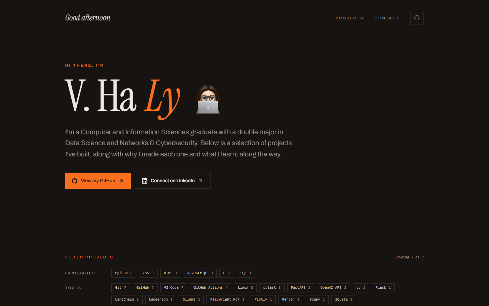

# havl-code.github.io ⚡

**My projects, why I built them, and what I learnt along the way.**

My personal website: one page with a selection of the projects I've built, each with the story
behind it, a filter to find projects by language or tool, and a small hidden extra for
speedcubers. It's live at **[havl-code.github.io](https://havl-code.github.io)**.


[](https://havl-code.github.io)

---

## ✨ Features

### 👋 Introduction

- **A Greeting for Your Time of Day:** good morning, good afternoon, or good evening, worked
  out in your browser from your local time
- **Quick Links:** jump straight to my GitHub or LinkedIn, or to the projects or contact
  sections from the top bar
- **This Site's Source:** the GitHub button in the top corner brings you here

### 🗂️ Projects

- **The Story Behind Each One:** what it does, why I built it, and what I learnt making it
- **Languages and Tools:** every project lists what it's built with, from Python and C to
  FastAPI, LangGraph, and Playwright MCP
- **Previews:** a screenshot of each app, or for command-line projects, a terminal that types
  out a session as it scrolls into view
- **Links:** every project links to its GitHub repo, plus a live demo where there is one

### 🔎 Project Filter

- **By Language or Tool:** pick a language or tool to show only the projects that use it, and
  pick it again (or click Clear) to see them all
- **Counts at a Glance:** each option shows how many projects use it, and the filter shows how
  many projects are showing

### ⏱️ A Hidden Cube Timer

- **For Speedcubers:** there's a small 3x3 timer tucked away in the footer
- **Works Like a Stackmat:** hold Space (or press and hold the timer) until the time turns
  green, let go to start, and press any key or tap to stop
- **WCA-Style Scrambles:** a new random scramble for every solve, never turning the same face
  twice in a row or one axis three times running
- **Your Best Time:** saved in your browser, so it's still there next visit

### 🎨 Look and Feel

- **Dark and Warm:** a dark theme with an orange accent, set in Archivo and Instrument Serif
- **Gentle Motion:** sections fade in as you scroll, and all of it switches off if your system
  asks for reduced motion
- **Works on Any Screen:** the layout adapts from a phone to a wide monitor

---

## 🛠️ Tech Stack

- **Framework:** [Next.js](https://nextjs.org/) with [React](https://react.dev/), exported as
  plain static files, so there's no server to run
- **Language:** [TypeScript](https://www.typescriptlang.org/), type-checked with TypeScript 7
- **Styling:** [Tailwind CSS](https://tailwindcss.com/) and
  [shadcn/ui](https://ui.shadcn.com/), with icons from [Lucide](https://lucide.dev/)
- **Fonts:** [Archivo](https://fonts.google.com/specimen/Archivo) and
  [Instrument Serif](https://fonts.google.com/specimen/Instrument+Serif), from Google Fonts
- **Testing:** [Vitest](https://vitest.dev/), covering the project list, the cube timer's
  scrambles and time format, the terminal previews, the greeting, and the project filter
- **Hosting:** [GitHub Pages](https://pages.github.com/)

---

## 📁 What's in This Repo

This repo holds the **built site only**: the HTML, CSS, JavaScript, and images that GitHub Pages
serves. The source code lives in a separate private repo, and a GitHub Actions workflow there
tests and builds the site, then publishes the result here.

```text
havl-code.github.io/
├── index.html      # The page itself
├── 404.html        # Shown for any address that doesn't exist
├── _next/          # The site's scripts, styles, and fonts
├── projects/       # Project screenshots
├── avatar.png      # My avatar in the introduction
├── docs/           # Images used in this README
├── .nojekyll       # Tells GitHub Pages to serve _next/ as it is
└── README.md
```

Every file here is replaced each time the site is published, so changes made directly in this
repo won't last.

---

## 📬 Get in Touch

Have a question about one of my projects, or an opportunity you'd like to discuss? The
[contact section](https://havl-code.github.io/#contact) on the site has my email, or you can
find me on [LinkedIn](https://www.linkedin.com/in/viet-ha-ly/).

---

## 📝 Copyright

© 2026 V. Ha Ly. All rights reserved. The projects linked from the site have their own
licences in their own repos.

---

Thanks for stopping by! ⚡
